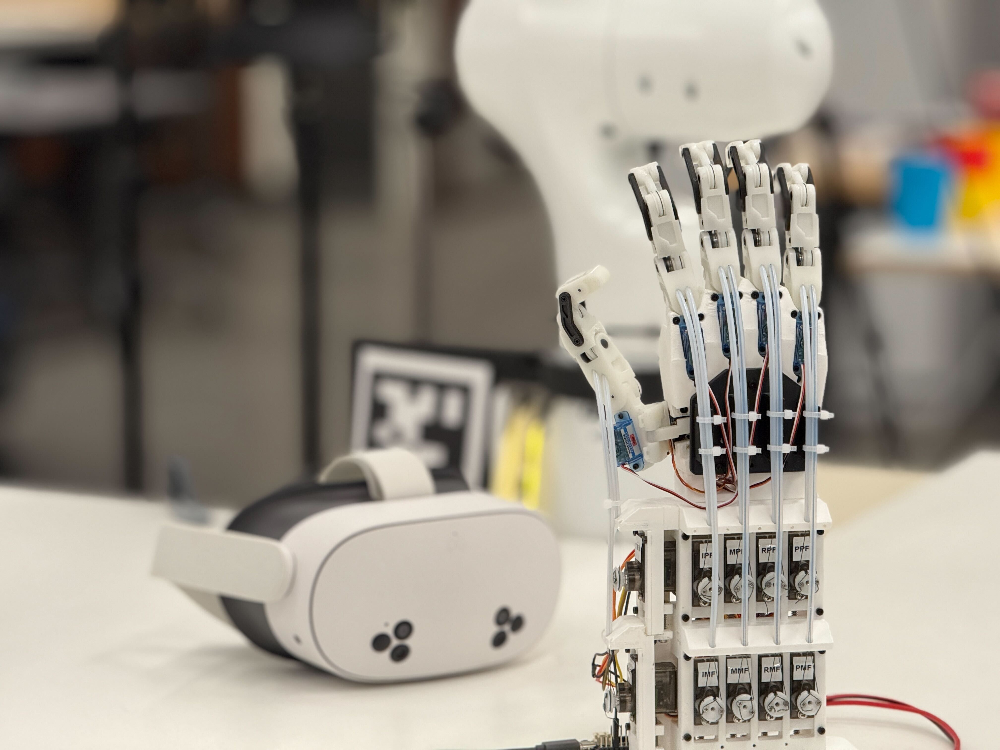

# Biomimetic Dexterous Hand
Author: [Zhengyang Kris Weng](https://wengmister.github.io/)

Open source release of biomimetic dexterous robotic hand, a 10-week M.S.Robotics 2025 Winter project. This guide will help you build your own hand and get your started on the setup.

# Overview

This is the open source release of the MSR Dexterous Hand V3, a robotic hand featuring 16 degrees of freedom. It utilizes a cable-and-pulley system, with 15 servos arranged in `N configuration` to drive its 15 joints with tendon.

Each finger provides three degrees of freedom: metacarpal (MCP) adduction/abduction, MCP flexion/extension, and proximal interphalangeal (PIP) flexion/extension. A custom four-bar linkage at the distal end of each phalanx converts the PIP motion into a coupled movement at the distal interphalangeal (DIP) joint. The thumb is designed with four degrees of freedom, including carpometacarpal (CMC) adduction/abduction and flexion/extension, as well as MCP adduction/abduction and flexion/extension.

The hand is controlled through provided `ROS2` packages found in `/src`. It provides several modes to interface with the robot - `motion shadowing` and `servo input` streaming through `ROS2` topic, or direct `servo input` control through CLI. See packages in `/src` for more details.

# Hardware Setup

STEP file for the cad asset can be found under `/cad_asset`. Individual 3D printables will be released soon.

Other than the 3D printing files, you'll also need:

- [MG90S 9G Servo Motor](https://www.amazon.com/Miuzei-Geared-Helicopter-Arduino-Project/dp/B0BWJ2CK9D)
- [GH-S37D 3.7G Servo Motor](https://www.amazon.com/SpiderWire-DuraBraid-Braid-Fishing-Line/dp/B0C69TLSHK)
- [PCA9685 16 Channel I2C Servo Driver](https://www.amazon.com/Teyleten-Robot-PCA9685-Compatible-Raspberry/dp/B0CNVBWX2M)
- ESP32 dev board ([Adafruit ESP32 Feather](https://www.adafruit.com/product/3405) used in my builds) 
- 5V 3A Power Supply    

- [DuraBraid fishing wire](https://www.amazon.com/SpiderWire-DuraBraid-Braid-Fishing-Line/dp/B0C69TLSHK)
- [Compression spring](https://www.mcmaster.com/2006N111/)

Fasteners:
- Shoulder Screws
    - 3 mm Shoulder Diameter, 6 mm Shoulder Length, M2 x 0.4 mm Thread
    - 3 mm Shoulder Diameter, 8 mm Shoulder Length, M2 x 0.4 mm Thread
    - 3 mm Shoulder Diameter, 10 mm Shoulder Length, M2 x 0.4 mm Thread
    - 3 mm Shoulder Diameter, 12 mm Shoulder Length, M2 x 0.4 mm Thread
    - 3 mm Shoulder Diameter, 20 mm Shoulder Length, M2 x 0.4 mm Thread
- SHCS
    - M1.6x0.35 mm Thread, 4mm
    - M2x0.4 mm Thread, 8mm
    - M2x0.4 mm Thread, 12mm
    - M3x0.5 mm Thread, 16mm
    - M4x0.7 mm Thread, 25mm
- Flat head screws
    - M1.6x0.35, 2mm
- Shims
    - 1.7mm ID x 4mm OD

Build instruction currently under construction, will be released soon.

For `V3`, flash and deploy `esp32_multi_servo_control/feather` through `Arduino IDE`.

# Environment Setup

This project currently runs on `ROS2-JAZZY`. To build locally, run:

    git clone https://github.com/wengmister/Dex_Hand_MSR.git
    cd Dex_Hand_MSR
    rosdep install --from-paths src -y --ignore-src

Finally, 

    colcon build
    . install/setup.bash

# Quickstart
### Hand Control

For motion shadowing:

    ros2 launch hand_motion_shadowing shadowing.launch.xml usb:=/dev/ttyACM0

For direct servo control:

    ros2 launch hand_servo_control multi_servo_control.launch.xml usb:=/dev/ttyACM0

Change usb port based on your device setting.

For Franka MoveIT! config demo:

    ros2 launch combined_fer_moveit_config demo.launch.py

### Franka Integration

For deploying on real Franka Fer, copy and build the following packages to your robot `station`:
- hand_rviz
- combined_fer_moveit_config

On station, run:

    ros2 launch combined_fer_moveit_config real.launch.py use_rviz:=false robot_ip:=[YOUR_ROBOT_IP]

On your laptop, run:

    ros2 launch combined_fer_moveit_config moveit_rviz.launch.py robot_ip:=[YOUR_ROBOT_IP]

# Demo

### Mixed Reality Motion Shadowing      

### Franka FER Integrated    

# License
MIT