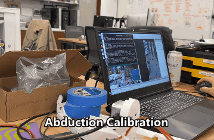
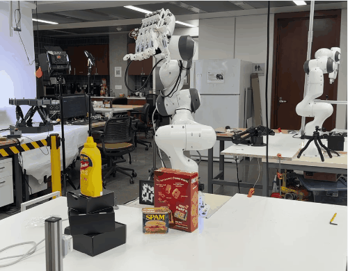
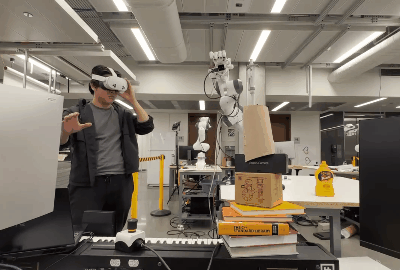

# BiDexHand: Open-Source 16-DoF Biomimetic Dexterous Hand
Author: [Zhengyang Kris Weng](https://wengmister.github.io/)   
[arXiv](https://arxiv.org/abs/2504.14712) | [OnShape](https://cad.onshape.com/documents/01cd86c3e9db901b13d9f00a/w/85362aa967854376c1ce3eaf/e/cdd4272996feef8877266f8c?renderMode=0&uiState=68e7603e87a047038d7ce8cc) | [Blogpost](https://wengmister.github.io/#dexterous-hand)

Open source release of BiDexHand. This guide will help you build your own hand and get your started on the setup.

# Overview

This is the open source release of the BiDexHand V4, a robotic hand featuring 16 degrees of freedom. It utilizes a cable-and-pulley system, with 15 servos arranged in `N configuration` to drive its 15 joints with tenden, and a 4-bar linkage driven 16th joint.

Each finger provides three degrees of freedom: metacarpal (MCP) adduction/abduction, MCP flexion/extension, and proximal interphalangeal (PIP) flexion/extension. A custom four-bar linkage at the distal end of each phalanx converts the PIP motion into a coupled movement at the distal interphalangeal (DIP) joint. The thumb is designed with four degrees of freedom, including carpometacarpal (CMC) adduction/abduction and flexion/extension, as well as MCP adduction/abduction and flexion/extension.

The hand is controlled through provided `ROS2` packages found in `/src`. It provides several modes to interface with the robot - `motion shadowing` and `servo input` streaming through `ROS2` topic, or direct `servo input` control through CLI. See packages in `/src` for more details.

**V4 Updates in a nutshell:**
- Updated single shear phalanx
- Added servo calibration modules
- Now using unified FeeTech servos (see [BOM](/BOM.md) update)
- Now using servo2040 for PWM builds
- Franka whole arm VR teleoperation (see [this repo](https://github.com/wengmister/franka-vr-teleop) for more details)

# Hardware Setup

STEP file for the cad asset can be found under `/cad_asset/_stp`, and individual STL file under `/cad_asset/_stl`. Additionally, you can find CAD hosted online on [OnShape](https://cad.onshape.com/documents/01cd86c3e9db901b13d9f00a/w/85362aa967854376c1ce3eaf/e/cdd4272996feef8877266f8c?renderMode=0&uiState=68e7603e87a047038d7ce8cc).

See [BOM.md](/BOM.md) for more details.

For `V4`, build, flash and deploy `/scripts/Servo2040/servo2040_controller` to controller for the PWM version. Alternatively, use script from `V3` fork for SCS bus builds.
- You'll need `pico-sdk` and `pimoroni-pico` modules to build the PWM project.

# Environment Setup

This project is primarily tested on `ROS2-JAZZY`. To build locally, run:

    git clone https://github.com/wengmister/BiDexHand.git
    cd BiDexHand
    rosdep install --from-paths src -y --ignore-src

Finally, 

    colcon build
    . install/setup.bash

# VR Setup

If you plan to use Meta Quest for the motion shadowing demo, you can follow the build and deployment steps in [this repo](https://github.com/NU-MECH-ENG-495/vr-hand-tracking).

# Quickstart
### Hand Control

For motion shadowing:

    ros2 launch hand_motion_shadowing shadowing.launch.xml usb:=/dev/ttyACM0

For direct servo control:

    ros2 launch hand_servo_control multi_servo_control.launch.xml usb:=/dev/ttyACM0

Change usb port based on your device setting.

For Franka `MoveIT!` config demo:

    ros2 launch combined_fer_moveit_config demo.launch.py

### Franka Integration

For deploying on real Franka Fer, copy and build the following packages to your robot `station`:
- hand_rviz
- combined_fer_moveit_config

On station, run:

    ros2 launch combined_fer_moveit_config real.launch.py use_rviz:=false robot_ip:=[YOUR_ROBOT_IP]

On your laptop, run:

    ros2 launch combined_fer_moveit_config moveit_rviz.launch.py robot_ip:=[YOUR_ROBOT_IP]

See [this repo](https://github.com/wengmister/franka-vr-teleop) on details about whole arm teleoperation!

# Demo

### Mixed Reality Motion Shadowing      

### Calibration

### Franka FER Integration    

### Franka VR Teleoperation    

# Citation
If you find this work helpful for your work or research, please consider citing as:

    @misc{weng2025bidexhand,
        title={BiDexHand: Design and Evaluation of an Open-Source 16-DoF Biomimetic Dexterous Hand}, 
        author={Zhengyang Kris Weng},
        year={2025},
        eprint={2504.14712},
        archivePrefix={arXiv},
        primaryClass={cs.RO},
        url={https://arxiv.org/abs/2504.14712}, 
    }

# License
MIT

# Related Repo
[Franka VR Teleop](https://github.com/wengmister/franka-vr-teleop)  
[VR Tracking App](https://github.com/wengmister/quest-wrist-tracker)  
[VR dex-retargeting](https://github.com/wengmister/vr-dex-retargeting)  